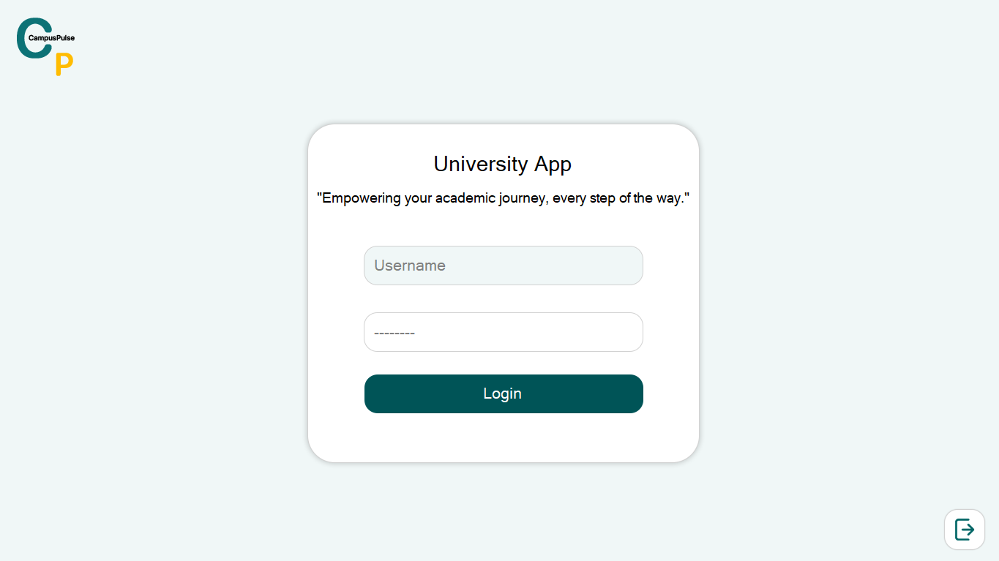
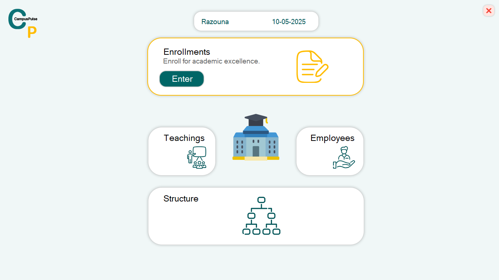
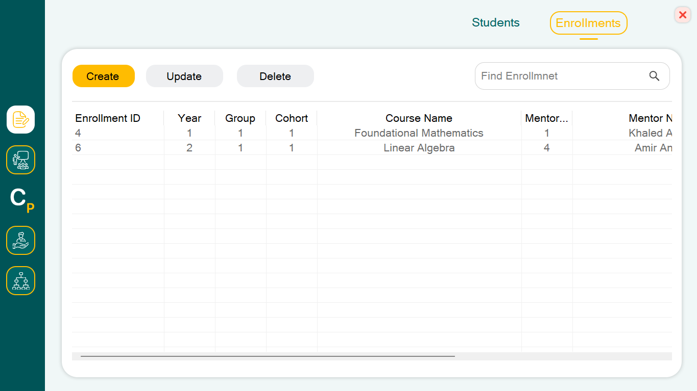
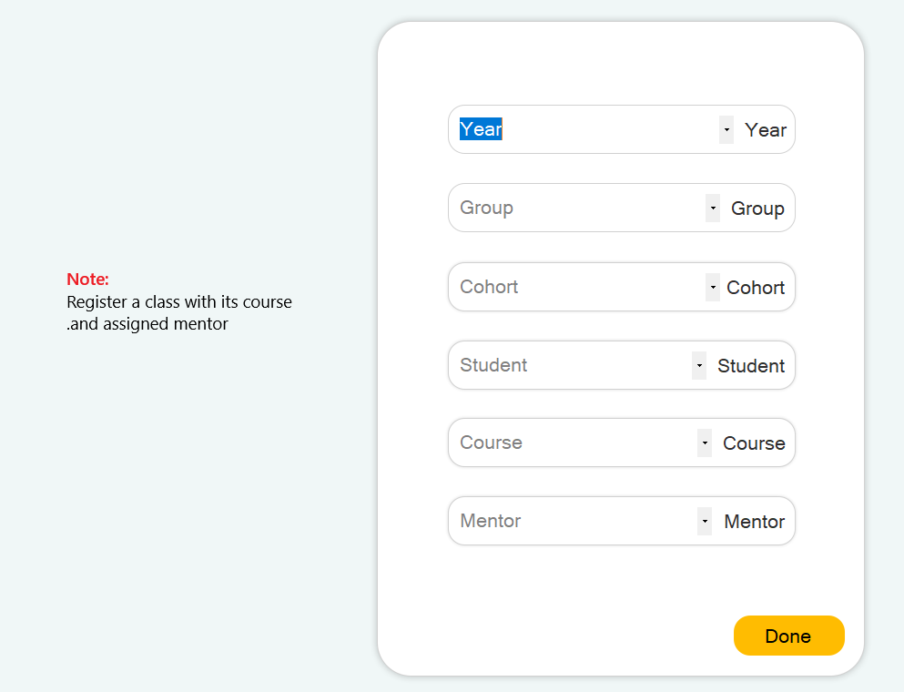

# 🏫 CampusPulse

**CampusPulse** is a desktop application built in **2024** using **C#** and **Windows Forms**.  
It simulates a lightweight **campus management system** to organize students, mentors, groups, cohorts, teaching sessions, and enrollments.

---

## 📦 Features

- 🔐 Login screen with credential validation
- 🧑‍🎓 Manage Students (add / edit / search)
- 👨‍🏫 Manage Teachers (Mentors)
- 📚 Teaching Sessions and Enrollment management
- 🏘️ Academic structure: Years, Groups, and Cohorts
- 🔄 CRUD operations using ListView controls
- 🔍 Search and filter records with input validation
- 🧭 Custom navigation and screen switching
- 🎨 UI image feedback on mouse events (hover / leave)

---

## 🛠️ Technologies Used

- **C#** with **Windows Forms**
- **.NET Framework**
- **Structs**, **OOP**, and **Composition**
- **Text Files (.txt)** for data storage
- Manual GUI design with **no third-party UI frameworks**
- Image-based icons and stylings (via `Resources` folder)

---

## 🖼️ Screenshots

> 📸 Below are some sample UI screens:

  
  
  

> ⚠️ Screens are fixed-size and not responsive by design.

---

## ⚠️ Notes

- This project was built **entirely from scratch** as part of my early programming training.  
- No external frameworks like Guna UI or Bunifu were used.  
- **UI design is handcrafted**, relying on **images** for visual feedback and styling.
- The app is **not responsive** (fixed screen dimensions), focusing instead on **manual practice** and deep learning.
- **Data is stored in local `.txt` files** instead of databases to simulate simple file-based backends.

---

## 🧠 Purpose

CampusPulse reflects my **learning phase in 2024**, during which I challenged myself to build a non-trivial system using core Windows Forms capabilities without relying on ready-made UI kits.

